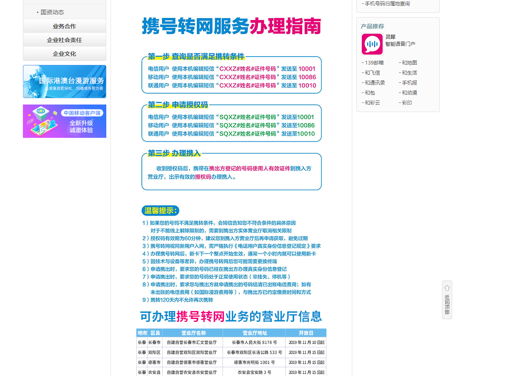

[Readme.md](./assets/README.md)

## 1. 编译 zlib 1.3.1
github 上拉取源代码 https://github.com/wenbozou/zlib/tree/feature_1.3.1
### 方法1：使用cmake编译

### 方法2：使用Visual Studio编译
在"contrib\vstudio\vc17" 目录下找到zlibvc.sln, 打开后编译即可。


## 2. 编译 OpenSSL 3.2.1 (集成 zlib)


## 3. Create a new Docusaurus project

4. Run the development server

5. Create a new blog post

6. Publish the blog post to GitHub Pages


7. ssh

8. Deploy

```js
9. ssh-agen 服务启动
```

```js
console.log('每个仓库都应该有个吉祥物。');
```

```jsx title="/src/components/HelloCodeTitle.js"
function HelloCodeTitle(props) {
  return <h1>Hello, {props.name}</h1>;
}
```