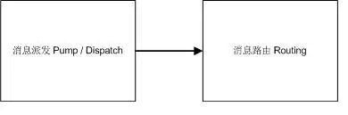
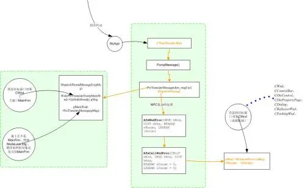
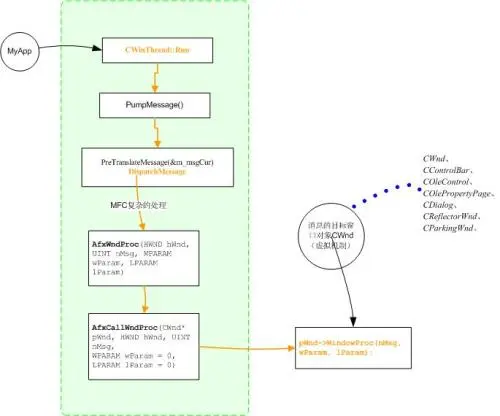
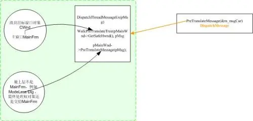
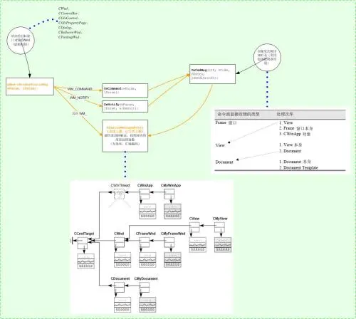
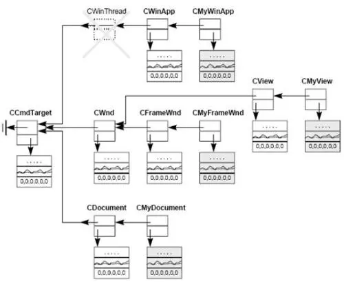
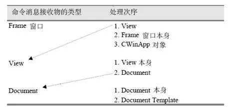
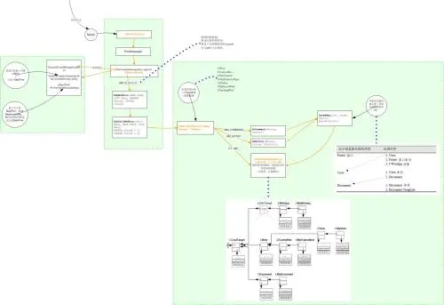

# MFC的消息机制
[引用链接](https://developer.aliyun.com/article/245516)

## 消息循环

MFC的消息循环(::GetMessage,::PeekMessage)、消息泵(CWinThread::PumpMessage)和MFC的消息在窗口之间的路由是两件不同的事情 分两个步骤完成：
<!---->

1 “消息派送”：非对话框程序（MFC Doc/View架构）和对话框程序略有不同，但原理相差不大。但除了少数的消息例如WM_QUIT，所有消息的派送流程基本一致。

2 “消息路由”：其中消息分有3种类型，各类型的路由过程不一样。非对话框程序和对话框程序的处理相同。 消息派送消息派送过程如下图 
<!---->

注意：方框代表类函数，圆圈代表执行函数的对象实体。类函数和执行函数的对象一定要分清楚。  程序启动后，构造全局变量tApp，并调用_tWinMain ->AfxWinMain ->AfxWinInit ->CWinThread::InitApplication ->CWinThread::InitInstance ->CWinThread::Run最终进入tApp对象的 CWinThread::Run 函数中。其中右框图中所有操作都是tApp对象完成的。
<!---->

 CWinThread的Run函数里面，调用了PumpMessage函数。PumpMessage是关键函数，它做了两件事情：调用PreTranslateMessage。MFC的消息预处理机制。 调用DispatchMessage做消息分发。 其中PreTranslateMessage函数的作用是：让每个消息的目标窗口(包括他的父窗口，注意不是父类)都有机会参与消息到来之前的处理。下文有具体该函数的内部处理。 DispatchMessage则调用AfxWndProc ,AfxWndProc 调用AfxCallWndProc ，而AfxCallWndProc 则做了关键的一步骤，调用 pWnd->WindowProc(nMsg, wParam, lParam);其中 pWnd为目标窗口对象。完成消息派送，消息成功派送到目标窗口对象的WindowProc函数中。 而后的事情，就是“目标窗口对象”收到消息后，进行消息路由和映射，找到改消息的处理函数。  再看看PreTranslate的内部处理：
 <!---->
 
 tApp对象的PreTranslateMessage操作有3种走向：如果(pMsg->hwnd == NULL),说明这是一个线程消息。调用CWinThread::DispatchThreadMessageEx到消息映射表找到消息入口，然后调用消息处理函数。

NOTE: 一般用PostThreadMessage函数发送线程之间的消息，他和窗口消息不同，需要指定线程id,消息被系统放入到目标线程的消息队列中；用ON_THREAD_MESSAGE( message, memberFxn )宏可以映射线程消息和他的处理函数。这个宏必须在应用程序类(从CWinThread继承)中，因为只有应用程序类才处理线程消息。

消息的目标窗口的PreTranslateMessage函数首先得到消息处理权，如果函数返回FALSE，那么他的父窗口将得到消息的处理权，直到主窗口；如果函数返回TRUE(表示消息已经被处理了)，那么就不需要调用父类的PreTranslateMessage函数。这样，保证了消息的目标窗口以及他的父窗口都可以有机会调用PreTranslateMessage--在消息发送到窗口之前进行预处理   如果消息的目标窗口和主窗口没有父子关系，那么再调用主窗口的PreTranslateMessage函数。例如非模式对话框

## 消息路由/映射
<!---->

到现在消息已经被目标窗口得到了。

主要分2种情况去找处理函数：WM_COMMAND,WM_NOTIFY处理类似

NOTE:MFC 把消息分为三大类：

命令消息（WM_COMMAND）：凡由UI 对象产生的消息都是这种命令消息，可能来自菜单或加速键或工具栏。SDK程序主要靠消息的wParam 辨识之，MFC 程序则主要靠菜单项目的识别码（menu ID）辨识之-- 两者其实是相同的。
凡衍生自CCmdTarget 的类别，皆有资格接收改类型消息。几乎构造应用程序的最重要的几个类别都衍生自CCmdTarget。标准消息- 除WM_COMMAND 之外，任何以WM_ 开头的都算是这一类。任何
衍生自CWnd 之类别，均可接收此消息。Control Notification - 这种消息由控制组件产生，为的是向其父窗口通知某种情况。例如当你在ListBox 上选择其中一个项目，ListBox 就
会产生LBN_SELCHANGE 传送给父窗口。这类消息也是以WM_COMMAND 形
式呈现。

“标准消息”处理最直观，直接调用AfxFindMessageEntry函数去“消息映射表”中寻找对应的处理函数。遍历顺序是沿着父类一直上溯。其中消息映射表是MFC代码类似于DECLARE_MESSAGE_MAP()等的宏搭建起来的网。
<!---->

按照MFC的规定。WM_COMMAND消息就不同了，消息经过了一个由MFC指定的路线。

路线图如下所示：

就是在OnCmdMsg(nID, nCode, pExtra, pHandlerInfo)实现了这个路线。
<!---->

至此。消息处理全部完成。全图如下：
<!---->

其他备注：

只要线程有界面元素或者调用GetMessage,或者有线程消息发送过来，系统就会为线程创建一个消息队列。窗口属于创建他的线程。用SendMessage等发送消息到指定窗口，则把该消息放到窗口所在的消息队列。或者可以直接用PostThreadMessage给指定id线程发送消息。 ::PeekMessage(&msg,NULL,0,0,PM_NOREMOVE)的最后一个参数指定检查消息后，把不把消息移出消息队列。 关注OnIdle函数：在CThreadWnd发现消息队列中并没有消息的时候，则调用该函数。用户可重载该函数。在这个处理中将更新UI界面(比如工具栏按钮的enable和disable状态)，删除临时对象(比如用FromHandle得到的对象指针。由于这个原因，在函数之间传递由FromHandle得到的对象指针是不安全的，因为他没有持久性)