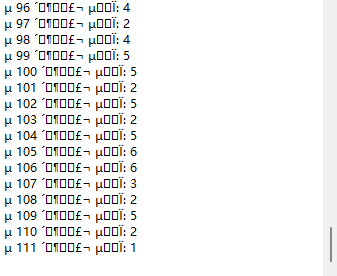
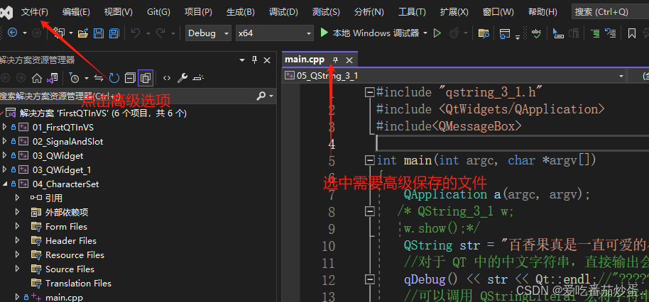
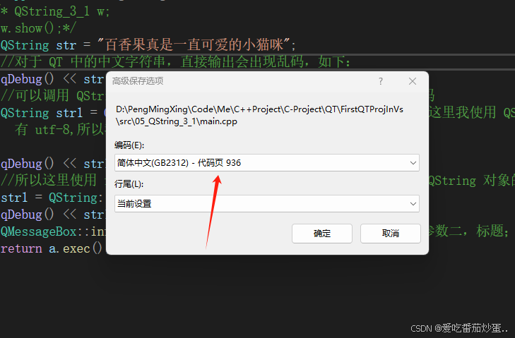
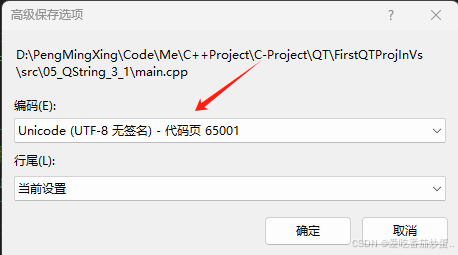
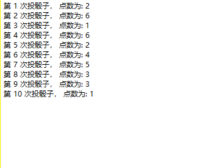

# Visual Studio 2022 Qt VS Tools 环境中文字符乱码问题

[原文出处](https://blog.csdn.net/m0_51005282/article/details/142308244)

## 问题描述

在 QT 中使用中文字符串常会出现乱码现象，如下所示：

```
QString str = "百香果真是一直可爱的小猫咪";
qDebug() << str << Qt::endl;//"?????????????????Сè??" 输出为乱码
```
or
```
	std::wstring wstr;
	wchar_t buff[200] = {0};
#ifdef _MSC_VER
	swprintf_s(buff, _countof(buff), L"第 %d 次投骰子， 点数为: %d", seq,diceValue);
#else
	std::swprintf(buff, _countof(buff), L"第 %d 次投骰子， 点数为: %d", seq, diceValue);
#endif
	
	QString qstr;
#ifdef _MSC_VER
	qstr = QString::fromWCharArray(buff);//QString::fromUtf16((const ushort*)buff);
#else
	qstr = QString::fromStdWString(buff);
#endif
	ui->plainTextEdit->appendPlainText(qstr);
```

结果如下图所示:



## 问题原因

出现这种问题主要是因为QT Creator 5 及其之后的默认编码方式为 UTF-8,所以 QString 默认认为字符串都是 UTF-8 格式，如果字符串不是 UTF-8 格式，QString 在转码为内部 Unicode 编码方式时就会出现乱码的现象。

其实最好的解决方法就是将编码格式转变为 UTF-8,当然也要根据实际情况随机应变。
以下提供几种方法，仅供参考

### 方法一：高级保存选项切换当前文件编码格式为 UTF-8

选中需要高级保存的文档 -> 菜单栏选择文件 -> 选择高级保存选项 -> 然后选择正确的编码方式即可; VS 2022 这里默认是使用 GB2312 编码方式，所以只需要将编码方式改为 UTF-8 即可







当我们修改完编码方式为 UTF-8,字符串的默认编码方式就是 UTF-8,而不是 GB2312,所以 QString 在转码的时候就会正常转码，不会出现乱码的现象



## 方法二：使用 #pragma execution_character_set(“utf-8”) （VS2025 之后过期）将文件编码格式改为 UTF-8
  *指定用于字符串和字符文本的执行字符集，但是该编译指令在 VS 2015 之后就过期了，这里只做记录 *

## 方法三：使用 QStringLiteral 宏 和 fromLocal8Bit 方法

Qt Creator 一般来说默认是使用 UTF-8 编码，而 QStringLiteral 宏可以将字符串转换成 Qt 适配的 UTF-8 编码。

```
//Visual Studio 2022 - Qt 环境
QString str = "百香果真是一直可爱的小猫咪";
qDebug() << str << Qt::endl;//"?????????????????Сè??" 输出为乱码
//这里使用 QStringLiteral 将字符串转换为 UTF-8 编码格式
str = QStringLiteral("百香果真是一直可爱的小猫咪");
qDebug() << str << Qt::endl;//"\u0019ù\u0015\n???\u0004è\u001F" 输出仍然为乱码
```

上面代码中我一开始将直接输出字符串，未进行任何处理，输出为乱码，然后我使用 QStringLiteral 宏将字符串转换为 UTF-8 编码格式，输出仍然为乱码，这个时候就需要考虑 VS 2022 当前的编码格式是否为 UTF-8 了，如果不是，可能使用 QStringLiteral 也会出现这种乱码行为，很显然，我们前面查看高级保存选项发现 VS 2022 默认编码方式是 GB2312,所以这里不对。

如果使用 QStringLiteral 不成功，我们还可以使用 QString::fromLocal8Bit 方法，它用于将使用本地编码方式（本地方式默认 GBK， GBK 和 GB2312 可以相互转换）转换为 QString 对象的内部 Unicode 编码。

```
str = QString::fromLocal8Bit("百香果真是一直可爱的小猫咪");
qDebug() << str << Qt::endl;//百香果真是一直可爱的小猫咪
//使用 QMessageBox 打开一个窗口输出该字符也不会出现乱码
QMessageBox::information(0, "title", str);//参数一：父窗口，参数二，标题；参数三，输出字符
```

这样就可以正确的表示我们想要输出的中文字符串，也就是说需要我们将中文字符串转换编译器的编码格式才能够正确的输出。

还有一点值得注意的是，当我们在 UI 界面上使用中文字符的时候，我们会发现他不会出现乱码行为，比如说我定义一个按钮，再其上面输入中文，如下：


当我们运行该程序的时候会发现他并没有出现乱码行为，而这个可以通过看 UI 界面生成的代码得到答案

```
void retranslateUi(QMainWindow *QString_3_1Class)
{
    QString_3_1Class->setWindowTitle(QCoreApplication::translate("QString_3_1Class", "QString_3_1", nullptr));
    pushButton->setText(QCoreApplication::translate("QString_3_1Class", "\344\270\255\346\226\207\346\214\211\351\222\256", nullptr));
} // ret

通过上述代码我们可以看出,他直接通过界面设计器将其转换成 UTF-8 格式，然后再通过 QCoreApplication::translate 方法将其翻译成对应的中文。